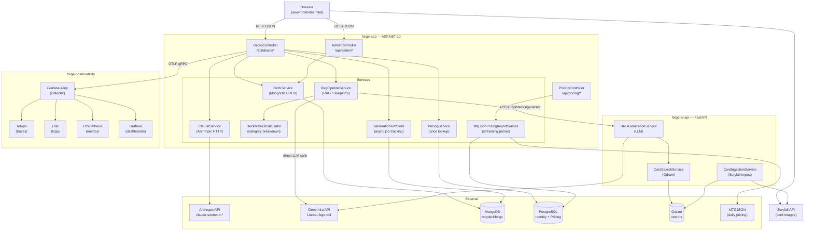

# mtg-forge — System Architecture

mtg-forge is a Magic: The Gathering deck management and AI generation platform built from three repositories that run as independent services, deployed on Railway or locally via Docker Compose.

---

## Architecture Diagram



---

## Functional Areas (forge-app)

Knowledge graph stats: **85 files · 1,288 symbols · 39 execution flows**

| Cluster | Symbols | Cohesion | Role |
|---|---|---|---|
| **Mtg-forge.Tests** | 78 | 93% | Unit / integration test suite |
| **Services** | 66 | 87% | Business logic, AI, pricing, persistence |
| **Controllers** | 55 | 86% | REST API surface |
| **Observability** | 5 | 100% | Logging / telemetry helpers |

---

## Key Execution Flows (forge-app)

### AI Deck Analysis (`Analyze → CategoryTokens`)
Cross-community · 5 steps

```
DecksController.Analyze
  └─ RagPipelineService.AnalyzeDeckAsync
       └─ DeckMetricsCalculator.Calculate
            └─ CountByExactCategory
                 └─ CategoryTokens
```

The controller delegates to `RagPipelineService`, which builds a RAG context before calling the LLM. `DeckMetricsCalculator` computes card-category breakdowns (lands, ramp, removal, etc.) used to ground the prompt.

### AI Deck Generation — async job (`Generate → GenerationJobDocument`)
Cross-community · 3 steps

```
DecksController.Generate
  └─ GenerationJobStore.Create
       └─ GenerationJobDocument  (Models/)
```

Generation is async: the controller creates a job record immediately and returns a job ID. Clients poll `GET /api/decks/generation-status/{jobId}`.

### CSV Import + Pricing (`ImportCsv → NormalizeCardName`)
Cross-community · 3 steps

```
DecksController.ImportCsv
  └─ PricingService.ApplyPricesAsync
       └─ NormalizeCardName
```

After parsing the CSV, `PricingService` enriches each card entry with current market prices from the local PostgreSQL pricing cache.

### Admin Analytics (`GetAnalytics → GetStringField`)
Intra-community · 4 steps

```
AdminController.GetAnalytics
  └─ DeckService.GetAnalyticsAsync
       └─ CountByStringField
            └─ GetStringField
```

Aggregates decks by string fields (format, commander, color identity) directly in MongoDB using the Driver's aggregation pipeline.

### Pricing Data Refresh (`Refresh → PrintingsParserState`)
Intra-community · 4 steps

```
PricingController.Refresh
  └─ MtgJsonPricingImportService.ImportDailyAsync
       └─ StreamParseUuidToNameAsync
            └─ PrintingsParserState
```

Streaming-parses large MTGJSON payloads (printings then prices) using state-machine parsers to avoid loading the full dataset into memory.

---

## This service: forge-app

**Role:** Primary user-facing service. Serves a REST API, Razor Pages, and a vanilla JS SPA from a single ASP.NET Core process. Owns authentication, deck CRUD, pricing, CSV import/export, and user/group management.

- **Port:** 5000
- **Databases:** MongoDB (decks, users, groups collections in `mtgdeckforge` db) + PostgreSQL (ASP.NET Identity tables + MTGJSON pricing cache in `AppDbContext`)
- **LLM mode:** `RagPipelineService` is the only registered `IDeckGenerationService`. It proxies deck generation to **forge-ai-api** and calls DeepInfra directly for analysis. `ClaudeService` (Anthropic) exists in the codebase but is not registered. There is no runtime `LlmProvider` switch.

---

## All services

### forge-app (`this repo` / `../forge-app`)
See above.

### forge-ai-api (`companion/forge-ai-api/` submodule · also at `../forge-ai-api`)
The RAG pipeline service. Responsible for card ingestion from Scryfall into Qdrant (vector store), semantic card search, and LLM-based deck generation. forge-app always calls this for deck generation via `RagPipelineService`. The source is included as a git submodule at `companion/forge-ai-api/`; a concise API contract is at `companion/forge-ai-api-contract.md`.

- **Port:** 8080 (Railway) / mapped to 5001 locally
- **Databases:** MongoDB (cards, saved decks in `mtgforge` db) + Qdrant (1024-dimensional vectors using DeepInfra `BAAI/bge-m3`, 1024-dim)
- **LLM backends:** DeepInfra (`meta-llama/Llama-3.3-70B-Instruct`) via OpenAI-compatible API. Ollama (`LLM__Provider=ollama`) is supported by the service but not used — all environments run on Railway with DeepInfra.

### forge-observability (`../forge-observability`)
The shared observability stack. Collects telemetry from both application services.

- **Components:** Grafana Alloy (collector/router), Tempo (traces), Loki (logs), Prometheus (metrics), Grafana (dashboards)
- **Ingest:** Alloy receives OTLP on port 4317 (gRPC) and 4318 (HTTP) and fans out to Tempo, Prometheus, and Loki

---

## Service connections

### forge-app → forge-ai-api

| | Local | Railway |
|-|-------|---------|
| Endpoint | `http://localhost:5001/api/decks/generate` | `http://mtg-forge-ai.railway.internal:8080/api/decks/generate` |
| Env var | `RagPipeline__BaseUrl` | `RagPipeline__BaseUrl` |
| Protocol | HTTP POST | HTTP POST |

`RagPipelineService` in this repo makes a single `POST /api/decks/generate` to forge-ai-api and receives a complete `DeckConfiguration` JSON response. After that call returns, this service overlays local prices (`PricingService.ApplyPricesAsync`) and persists the deck to its own MongoDB.

> **Note:** This service also calls DeepInfra **directly** (not through forge-ai-api) for deck analysis, budget replacement suggestions, and CSV import descriptions. Those calls use `RagPipeline:LlmBaseUrl` (`https://api.deepinfra.com/v1/openai`) and `RagPipeline:LlmApiKey`.

### forge-app → forge-observability

| Signal | Local | Railway |
|--------|-------|---------|
| Traces (OTLP gRPC) | `OTEL_EXPORTER_OTLP_ENDPOINT=http://tempo:4317` (direct to Tempo) | `OTEL_EXPORTER_OTLP_ENDPOINT=http://alloy.railway.internal:4317` |
| Logs (Loki sink) | `LOKI_URI=http://loki:3100` | `LOKI_URI=http://loki.railway.internal:3100` |
| Metrics | Prometheus scrapes `http://mtg-api:5000/metrics` | Alloy scrapes the Railway public/internal URL |

`/metrics` and `/logging` are protected by `InternalOnlyMiddleware` and only respond to Docker-internal IPs.

---

## Data flows

### Deck generation — Rag mode

```
Client
  → POST /api/decks/generate        (forge-app :5000)
    → RagPipelineService
      → POST /api/decks/generate    (forge-ai-api :8080)
          → CardSearchService → Qdrant (200-card semantic pool)
          → DeckGenerationService → ILlmService → DeepInfra (OpenAI-compatible)
          → MongoService (save in forge-ai-api MongoDB)
        ← DeckConfiguration JSON
      → PricingService.ApplyPricesAsync (PostgreSQL pricing cache)
      → DeckService (save in forge-app MongoDB)
    ← DeckConfiguration JSON
  ← response
```

### Deck generation — Claude mode

```
Client
  → POST /api/decks/generate        (forge-app :5000)
    → ClaudeService → Anthropic Messages API (claude-sonnet-4-*)
    → PricingService.ApplyPricesAsync
    → DeckService (save in forge-app MongoDB)
  ← response
```

### Card ingestion (runs in forge-ai-api, triggered externally)

```
GitHub Action or admin curl
  → POST /api/admin/ingest          (forge-ai-api :8080)
    → CardIngestionService
      → Scryfall bulk data API (download)
      → MongoDB (upsert cards)
      → IEmbedService → DeepInfra (embed each card, 1024-dim via BAAI/bge-m3)
      → Qdrant (upsert vectors with legality + color identity payload)
```

### Observability pipeline (Railway)

```
forge-app    ──OTLP gRPC──► Alloy :4317 ─┬─► Tempo       (traces, 72h retention)
             ──Loki HTTP──► Loki  :3100   ├─► Prometheus  (metrics, via remote_write)
             ◄──scrape /metrics── Alloy   └─► Loki        (logs)

forge-ai-api ──OTLP gRPC──► Alloy :4317       ↓
             ──Loki HTTP──► Loki  :3100    Grafana queries Prometheus / Tempo / Loki
             ◄──scrape /metrics── Alloy
```

---

## Deployment

### Railway (production)

All three repos are deployed as independent Railway services. Services communicate over Railway's private network via `*.railway.internal` DNS — these names are **not** reachable from the public internet or local machines.

**This service (forge-app) Railway env vars:**

| Variable | Value |
|----------|-------|
| `RagPipeline__BaseUrl` | `http://mtg-forge-ai.railway.internal:8080` |
| `RagPipeline__LlmBaseUrl` | `https://api.deepinfra.com/v1/openai` |
| `RagPipeline__LlmApiKey` | DeepInfra API key |
| `RagPipeline__Model` | `meta-llama/Llama-3.3-70B-Instruct` |
| `OTEL_EXPORTER_OTLP_ENDPOINT` | `http://alloy.railway.internal:4317` |
| `LOKI_URI` | `http://loki.railway.internal:3100` |
| `DATABASE_URL` | PostgreSQL connection string |
| `JWT_SECRET` | Auth signing key |
| `ADMIN_PASSWORD` | Seeded admin account password |
| `ANTHROPIC_API_KEY` | Required only if `LlmProvider=Claude` |

### Local development

| Command | What starts |
|---------|-------------|
| `docker compose -f docker-compose-local.yml up -d` | MongoDB (:27018), PostgreSQL (:5433), Prometheus (:9090), Grafana (:3000) — no API |
| `cd mtg-forge.Api && dotnet run` | API on :5000 (needs deps above running) |
| `docker compose up -d` | Full stack: MongoDB, API, Tempo, Loki, Prometheus, Grafana |
| `cd mtg-forge.Api && dotnet ef database update` | Apply PostgreSQL migrations |
